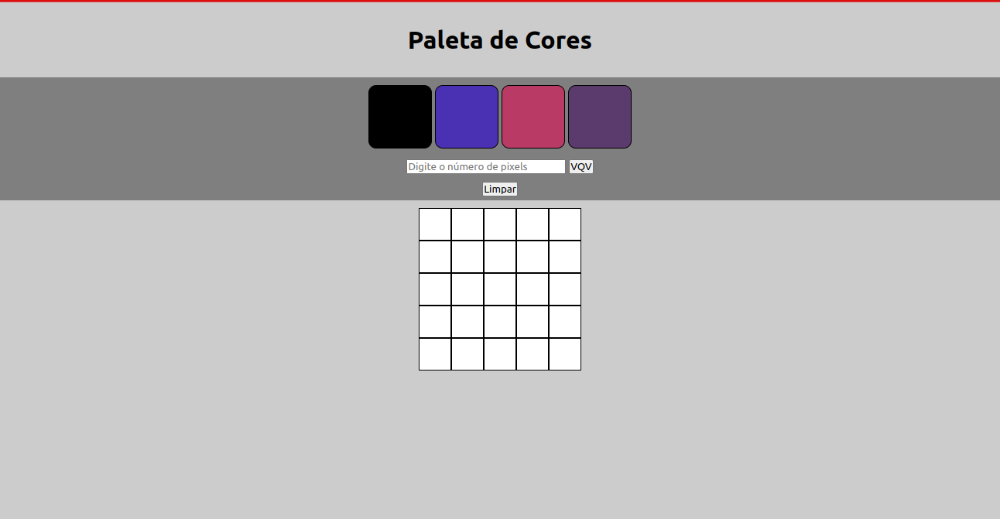
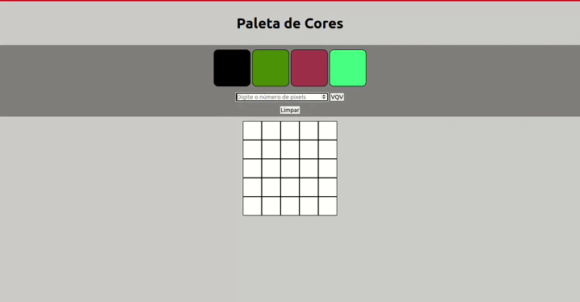
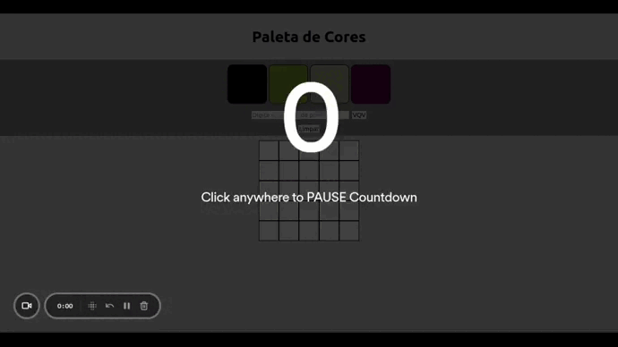

# Projeto 3 - Pixels Art

Oi. Este foi um dos projetos que eu fiz durante meu curso na Trybe. Confira os detalhes dele abaixo.

## Nome do Projeto
Pixels Art
## Linguagens e Ferramentas Utilizadas

 - JavaScript
 - HTML
 - CSS

## Objetivos do Projeto
O objetivo deste projeto foi desenvolver uma página que simule um quadro de pixels, que pode ser pintado.
Para isso, foi utilizado os conhecimentos adquiridos de HTML e CSS, unidos à programação utilizando JavaScript.

 
Abaixo estão capturas de tela do projeto.
 

 

Página Inicial:

 

Alterando número de pixels (com base no lado do quadrado) (mínimo 5 e máximo 50):

 

GIF mostrando o funcionamento da aplicação:

 

## Instruções para visualização
Comando para clonar o projeto:
 - `git clone git@github.com:BrunoSayago/projeto-03-PixelsArt.git`
 
Se necessário, instalar as dependências:
 - `npm install`
  
O projeto pode ser visto no navegador utilizando-se alguma extensão, como o live server.  
